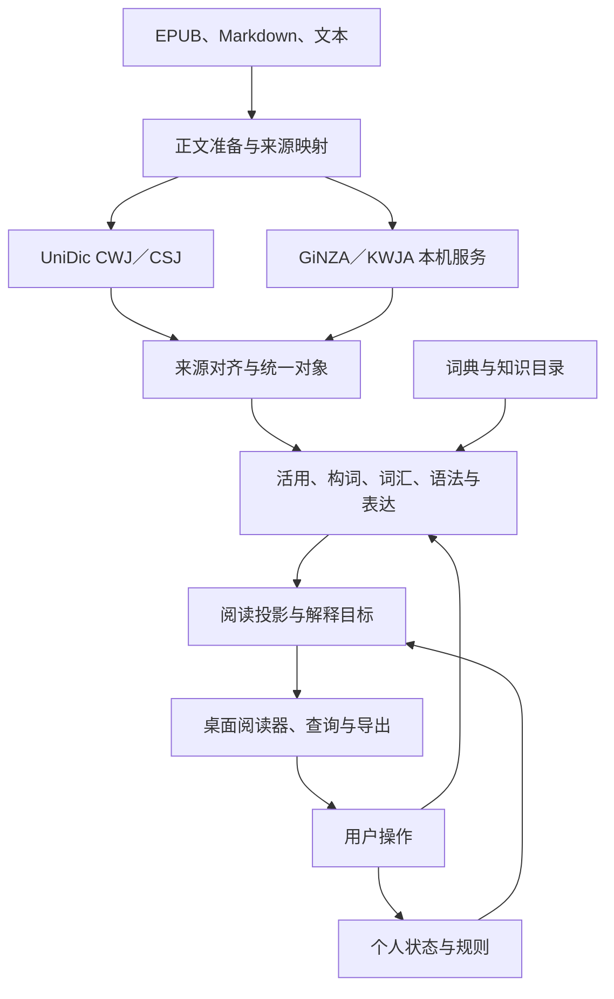

# 总体架构

## 处理流程

应用以准备后的正文作为共同输入，以字符范围关联各分析器的结果，再生成适合阅读、查询和用户操作的对象。

## 四级职责

| 层级 | 输入与输出 | 责任 |
| --- | --- | --- |
| L0 来源分析 | 准备后的正文 → 各来源结果 | 执行 UniDic、GiNZA、KWJA，保留各自 token、标签、关系和版本 |
| L1 统一对象 | 来源结果 → 统一词法与结构证据 | 校验文本、映射坐标、对齐 token、组织结构和分歧 |
| L2 应用分析 | 统一对象、词典、规则 → 阅读单位和知识实例 | 分析活用、构词、词典整体词、语法与表达，保存成立依据 |
| L3 查询与展示 | 应用分析、个人状态 → 阅读投影和解释结果 | 生成着色、注音、交互目标、词典查询、语法说明及导出内容 |

`kotoclip-nlp` 承担来源与语言对象处理；`kotoclip-core` 协调词典、知识目录、书库、用户数据和会话；Tauri 提供桌面命令及资源管理；Vue 消费投影并提交用户意图。

## 文本与身份

`PreparedDocument` 表示正文、作者注音、章节／图片锚点及来源映射。统一位置为 Unicode scalar 半开区间 `[start, end)`。来源字节位置、前端 UTF-16 位置和 DOM 位置经过显式转换后参与计算。

| 身份 | 含义 |
| --- | --- |
| 文档身份与文本版本 | 定位一本书或一次文本输入及其内容版本 |
| 分析单元出现身份 | 定位该文档内的一段正文；重复句拥有不同出现身份 |
| 产物引用 | 阶段、schema、输入摘要、资源版本和局部实体 ID |
| 词元知识身份 | 关联同词元的不同出现形式，使用经过核验的 UniDic 词元身份 |
| 出现锚点 | 文档、文本版本、字符范围及文本摘要，用于用户记录和跨版本定位 |

token ID 的有效范围由分析产物限定。模型更新、规则更新和用户操作分别具有版本，缓存与查询引用同时携带这些信息。CWJ、CSJ 的同值词元 ID 经资源核验后才能共享知识身份。

## 证据与决定

来源结果保留原始标签和来源引用；应用决定记录对象、采用状态、理由和竞争候选。来源已输出某个结构，表示该结果可观测；结构进入正文的条件由对应模块的校验与选择规则确定。

能力状态描述分析器是否就绪、缺少资源、执行失败或任务不受支持。识别状态描述某条结果是否成立、待定或被拒绝。两类状态分别传递到调用者，便于重试、复核和展示。

## 文档会话

后端拥有文档会话及其规范状态。打开文档时生成首批阅读结果，随后优先处理可见范围、相邻范围和章节跳转目标。长文本按段落、句界和引号上下文划分分析单元；每次调用保存单元到全文的偏移映射。

GiNZA、KWJA 各自复用本机服务和已加载模型。基础正文和 UniDic 结果完成后即可展示；结构结果完成时，以版本化更新追加应用分析和阅读投影。显式进度记录已完成范围、等待来源和失败单元。

目标会话接口包括打开、请求范围、继续分析、取消、关闭、提交实例修正和应用用户操作。请求携带会话 ID、文本版本和任务代次；更新携带基准版本与新版本。前后端均校验代次，过期结果结束于对应任务，版本不匹配时重新同步。

## 缓存与失效

缓存键由正文摘要、上下文、来源配置、算法版本和实际读取的资源版本组成。缓存按阶段保存，用户状态独立持久化。来源、模型、查询键、词典正文、规则和讲解内容分别声明依赖。

| 变化 | 重新计算范围 |
| --- | --- |
| 正文、准备规则或来源分词 | 受影响单元的来源分析及下游对象 |
| 外部模型或结构选择 | 对应结构产物及消费它的应用分析 |
| 构词、语法、表达规则 | 匹配作用域及其竞争范围内的结果 |
| 词典查询索引 | 词典候选和查询结果 |
| 讲解或词典正文 | 对应解释内容 |
| 已知状态、词典顺序或排版 | 对应个人投影、查询排序或布局 |

并发队列、模型实例和缓存均有容量限制。前台查询与后台分析分别调度，避免长文本分析持续占用查询服务。

## 代码入口

[analysis.rs](../crates/kotoclip-core/src/analysis.rs)是当前应用服务，[model.rs](../crates/kotoclip-nlp/src/model.rs)定义统一结果，[unify.rs](../crates/kotoclip-nlp/src/unify.rs)组装各层，[src-tauri/src/lib.rs](../src-tauri/src/lib.rs)注册桌面命令。目标会话与当前服务的差距见 [TODO](TODO.md)。
