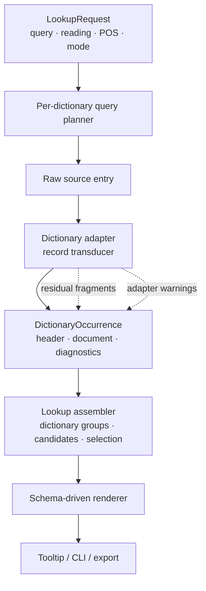

# 词典模块内部架构规范与实现差距

状态：**目标架构说明与当前实现审计（2026-07-18）**

相关文档：

- [`dictionary_lookup_and_bubble_refactor.md`](dictionary_lookup_and_bubble_refactor.md)：第一阶段重构协议和验收范围；
- [`dictionary_bubble.md`](dictionary_bubble.md)：当前模块入口与维护流程；
- [`dictionary_refactor_followups.md`](dictionary_refactor_followups.md)：后续项目清单；
- [`analysis/dictionary_refactor_source_notes.md`](analysis/dictionary_refactor_source_notes.md)：18 词原始 HTML 事实记录。

## 1. 文档目的

本文确定词典模块的内部设计形态，并逐层映射当前实现。讨论对象包括：

- 词条内容模型是固定字段、动态树、回退 HTML 还是组件框架；
- 适配器的计算模型、局部状态和跨调用状态；
- 查询、适配、缓存、用户选择和 UI 会话分别拥有何种状态；
- 未识别内容如何保留、定位和展示；
- 新词典、新源结构和新视觉模块通过什么扩展；
- 当前实现与目标设计之间的具体差距。

本文中的“目标设计”用于指导后续演进。第一阶段已经建立的 occurrence、查询职责和结构化词典边界继续有效。

## 2. 总体架构定位

词典模块采用分层、数据驱动、受控开放的文档系统。核心流程如下：



该架构有四个稳定边界：

1. 查询层决定命中对象和证据，不解释词典正文 DOM；
2. 适配层将一个源记录转换为零个、一个或多个 occurrence，不决定跨词典排序；
3. 统一内容模型保存词典事实和未知残片，不持有 Vue 组件引用；
4. renderer 根据节点类型选择受控组件，不从原始 HTML 重新推断语义。

## 3. 内容模型：固定核心、动态分支与受控扩展

### 3.1 设计结论

词条显示采用“固定核心节点语法 + 有序动态块 + 受控扩展类型”。

固定核心保证以下高频事实具有统一语义：

- occurrence identity；
- header；
- sense tree；
- gloss/definition；
- example/translation；
- tag/note/relation；
- section/subentry；
- residual fragment 和 diagnostics。

动态性来自三处：

- 节点是否存在决定显示分支；
- sense 和 section 可以递归、重复并保持源顺序；
- extension block 使用稳定 `type_id + schema_version + payload + fallback` 选择已注册 renderer。

适配器输出数据节点。组件选择由 renderer registry 控制。词典源内容不能直接指定任意前端组件、脚本或运行时代码。

### 3.2 目标结构

建议将 occurrence 正文收束为一个有序 document：

```text
DictionaryOccurrence
├─ identity
│  ├─ occurrence_id
│  ├─ dictionary_id
│  ├─ source_entry_id
│  └─ source_record_index
├─ kind
├─ header
├─ document
│  └─ blocks[]                 保持源顺序
├─ entry_relations[]
├─ diagnostics
└─ compatibility_projection
```

```text
DictionaryBlock
├─ SenseGroup { senses[] }
├─ Section { kind, label, items[] }
├─ NoteGroup { notes[] }
├─ Media { resource_ref, caption, fallback }
├─ ResidualFragment { sanitized_tree, reason, source_range }
└─ Extension { type_id, schema_version, payload, fallback }
```

`SenseGroup` 和 `Section` 仍使用当前 `DictionarySense`、`DictionarySectionItem` 等稳定对象。`blocks[]` 解决三项问题：

1. 主义项、说明、惯用语和未知片段可以按源顺序交错；
2. 已识别节点与未识别节点可以同时显示；
3. 新内容类型可以逐步加入，不要求把所有内容塞进 `senses[]` 或 `sections[]`。

document 内的每个可交互节点需要稳定 `node_id`。ID 优先由 source record ID、source path 和显式 marker 生成；顺序编号只作为没有稳定源锚点时的局部 fallback。稳定 ID 用于内部参照、折叠状态、回归断言和未来的 active sense projection。

### 3.3 文本与内联标记

`DictionaryText` 承载一个语言明确的文本片段。目标字段建议为：

```text
DictionaryText
├─ lang
├─ role                  gloss / definition / label / note / source / translation
├─ qualifier?
├─ inline[]              text / ruby / emphasis / abbreviation / link
├─ source_ref?
└─ confidence?
```

当前 `html` 字段继续作为兼容投影。长期内部表示使用受控 inline AST，可以减少字符串 HTML、重复 sanitizer 和 renderer 差异。

### 3.4 固定组件与扩展组件

公共 renderer 至少注册：

- `SenseTreeRenderer`；
- `SectionRenderer`；
- `ExamplePairRenderer`；
- `RelationRenderer`；
- `ResidualFragmentRenderer`；
- `GenericExtensionRenderer`。

extension registry 的契约：

```text
type_id              例如 dictionary.pitch-pattern.v1
schema_version       payload 版本
capability           text / table / media / interactive
renderer             应用内受信组件
fallback             未注册或版本不兼容时仍可显示的安全内容
```

新增词典可以复用核心节点和已注册扩展类型。只有稳定、跨样本重复且核心节点无法表达的内容才增加 extension type。

## 4. 当前 renderer 的实际形态

当前实现属于固定结构语法上的数据分支：

```text
DictionaryContent
├─ if senses or sections exist
│  ├─ DictionarySenseTree(senses)
│  └─ generic DictionarySection loop
└─ else
   └─ content_blocks rich HTML loop
```

具体能力：

- `DictionarySenseTree.vue` 递归处理任意深度的 `children`；
- `DictionaryContent.vue` 通用遍历 section/item/content/example/relation；
- `section.kind` 和 `tag.kind` 是开放字符串，可用于 CSS 和以后增加分支；
- `style_profile` 选择词典作用域样式；
- `DictionaryText.html`、`label_html` 提供经过清洗的有限内联 HTML；
- `content_blocks` 提供整条 fallback rich HTML。

当前动态边界：

- 没有 component registry；所有 section 使用同一模板；
- adapter 无法请求公共组件实例，只能填充现有字段；
- `senses/sections` 只要任一非空，Vue 就不渲染 `content_blocks`；
- 结构化内容和未知 fallback 片段无法在同一 occurrence 中按源顺序混合；
- `definition_html` 由 Rust 再生成一套兼容 DOM，Vue 同时维护独立 typed renderer，存在协议漂移面。
- `adapter_diagnostics` 和 `raw_definition` 不进入普通 Tooltip 正文；CLI 可以检查 diagnostics 和 raw HTML。

因此，当前实现已经覆盖固定核心与递归动态分支；有序 residual block 和受控 extension registry 尚未实现。

## 5. 适配器计算模型

### 5.1 设计结论

词典适配器定义为“单源记录、确定性、有限生命周期的结构转换器”。

输入：

```text
AdapterInput
├─ dictionary descriptor
├─ source entry identity
├─ indexed headword
├─ raw headword
├─ structured reading?
└─ raw definition HTML
```

输出：

```text
AdapterOutput
├─ occurrences[]
├─ consumed source ranges/nodes
├─ residual fragments[]
└─ diagnostics[]
```

同样输入和适配器版本必须产生同样输出。适配过程不读取用户画像、不访问其他词典、不执行网络请求、不根据历史查询改变规则。

### 5.2 允许的局部状态

适配器在一次调用中可以持有：

- DOM traversal stack；
- 当前 source path；
- sense ID counter；
- marker hierarchy stack；
- record drafts；
- 已消费节点集合；
- 局部 symbol table，例如 marker path 到 sense ID；
- warning/residual accumulator。

这些对象在调用结束后释放。它们用于解析嵌套结构和前后依赖，不形成跨词条记忆。

### 5.3 规则形式

目标适配器由两类规则组成：

1. 声明式映射：class/tag/attribute 到字段、标签和节点类型；
2. 命令式结构钩子：处理层级编号、相邻作用域、占位展开、内部引用、异常嵌套和词典特有记录拆分。

简单源格式优先使用声明式规则。复杂层级使用小范围命令式函数。每个阶段结束后执行 residue 和结构验证。

### 5.4 标准处理阶段

```mermaid
flowchart LR
    A["Parse fragment"] --> B["Split source records"]
    B --> C["Extract occurrence identity/header"]
    C --> D["Segment semantic containers"]
    D --> E["Build senses/sections/examples"]
    E --> F["Resolve local relations/scopes"]
    F --> G["Account for consumed/residual nodes"]
    G --> H["Validate and emit diagnostics"]
    H --> I["Generate compatibility projection"]
```



阶段之间传递显式 context，避免一个大型函数同时完成词头、正文、关系和清洗。

## 6. 当前适配器的实际形态

当前三本适配器符合以下特征：

- 输入限定为一个 SQLite entry 的原始 definition 和稳定索引字段；
- 使用 `html5ever` tokenizer 构造轻量 `HtmlElement/HtmlNode` 树；
- 适配器函数没有外部可变状态；
- `LazyLock<Regex>` 是进程级不可变规则缓存；
- counter、stack、draft、临时 Vec/HashSet 均为调用内状态；
- 小学馆可以把一个源 entry 拆成多个 occurrence；
- 查询层使用 presentation cache 保存适配结果，缓存不改变语义输出。

当前轻量 HTML 树只使用 `html5ever` tokenizer，后续由自定义 stack 关闭元素。它提供稳定、宽容且便于词典规则遍历的树；完整 HTML5 tree builder 的 foster parenting、adoption agency 等浏览器级纠错规则没有进入该实现。源片段严重不规范时，适配树与浏览器 DOM 仍可能不同。

各适配器当前实现方式：

- 大辞林：约 1,500 行命令式结构解析，使用 counter、递归遍历和 DOM 顺序切分 major/rect/pair；
- 小学馆：先拆 `<h3> + <section>`，使用 `SenseDraft + level stack` 建树；
- Crown：按固定 class 遍历义项、例句和 section，层级相对扁平；
- Generic：安全清洗整段 HTML，生成单个 fallback block。

当前实现可以描述为“手写的确定性 DOM transducer”。规则分阶段程度因词典而异；尚无统一 AdapterContext、消费节点账本、规则描述表或适配器版本声明。

适配器入口当前直接返回 `Vec<AdaptedOccurrence>`。解析错误、部分覆盖和主动省略通过 diagnostics 字符串表达；尚无 `AdapterOutcome<Result>`、typed error code 或 severity。

## 7. 状态所有权与生命周期

词典模块包含五类状态。各类状态必须保持边界清晰。

| 状态层 | 当前所有者 | 生命周期 | 允许内容 |
| --- | --- | --- | --- |
| 源数据状态 | SQLite/definition blocks | 词典包版本 | entry、form、reading、alias、压缩 definition |
| 服务缓存状态 | `DictionaryEngine` | 进程/服务实例 | exact existence、definition block、presentation output |
| 请求状态 | lookup 调用栈 | 单次查询 | query、reading、POS、mode、score、candidate、timing |
| 用户持久状态 | `ProfileEngine` | 跨会话 | 词典顺序、默认词典、明确 target 选择 |
| UI 会话状态 | `TooltipPanel.vue` | 当前气泡 | active dictionary、每词典 active occurrence、导航历史 |

适配器本身只拥有调用内状态。presentation cache 位于查询服务，key 当前为 `(database_index, entry_id)`。

设计约束：

- 适配器版本或 IR schema 变化时，缓存语义 key 必须随之变化，或由服务重启清空；
- 用户 target 选择不写入适配器输出；
- UI active occurrence 不反向修改 dictionary occurrence；
- 查询 score 和 `is_preferred` 属于请求投影，不写入 presentation cache。

当前用户 target 选择 key 为 `query + reading`。POS、mode、document scope 和上下文签名尚未进入 key；同表记同读音在不同语法身份或查询模式下可能共享同一持久选择。目标设计需要为选择声明 scope，并把 scope 组成 cache/persistence key。

## 8. 查询结果与选择模型

### 8.1 目标设计

Lookup 应显式按词典分组：

```text
DictionaryLookup
├─ request
├─ target_candidates[]
├─ dictionary_groups[]
│  ├─ dictionary_id
│  ├─ occurrences[]
│  ├─ selected_occurrence_id?
│  ├─ selection_status       resolved / ambiguous / unavailable
│  └─ diagnostics
└─ timing
```

每本词典独立表达 occurrence 选择和歧义状态。target candidate 表示需要重新查询的其他表记/读音/词条目标；occurrence candidate 表示当前词典已经加载的多个真实记录。

### 8.2 当前实现

当前 `DictionaryLookup` 使用：

- 扁平 `entries[]`；
- `dictionary_names[]`；
- 单个 `selected_occurrence_id`；
- `candidates[]`；
- 前端临时构造 `Map<dictionary, entries>` 和 `selectedOccurrenceByDictionary`。

该实现可以支持当前 UI，但服务协议没有直接表达每本词典的 resolved/ambiguous 状态。没有明确 preferred 时，Tooltip 默认打开第一条 occurrence，并通过“无星标”隐式表达不确定性；当前普通 UI 没有独立的“未消歧”状态标签。`DictionaryCandidate.reading/entry_kind/occurrence_ids` 在当前候选装配中也大多为空。

`mode` 当前在 `DictionaryLookup` 装配后写入响应，尚未作为参数进入 `DictionaryEngine::lookup_profiled_with_pos()`。实际 planner 固定执行 direct lookup、dictionary-local redirect/alias、compatibility alias，并在无 direct 结果时尝试 reading fallback。contextual/navigation/search 三种策略目前属于协议设计，尚未形成三个可执行 policy。

## 9. 表头作用域

表头包含两类事实：

1. occurrence 全局事实：display form、reading、entry kind、全局 POS、全局 usage、词源；
2. 当前分支事实：局部 POS、局部 grammar、局部 pronunciation、form scope、限定说明。

目标设计保留 occurrence header，并增加可选 `ScopeProjection`：

```text
ScopeProjection
├─ active_sense_id
├─ inherited_tags[]
├─ pronunciations[]
├─ scoped_forms[]
└─ notes[]
```

UI 只有在用户聚焦、展开或选择某个 sense 时才生成该 projection。没有 active sense 时，局部事实继续显示在正文节点。

当前实现只具备 occurrence header 和 sense-local tags。`ごちゃごちゃ` 的 1/0 音调仍聚合在 occurrence header；UI 没有 active sense 状态。

## 10. 未识别内容与回退语义

### 10.1 目标回退层级

回退采用四级策略：

1. inline fallback：未知内联标记转成安全文本/inline AST；
2. residual block：未知子树按原顺序保留在 document blocks；
3. whole-record fallback：记录完全无法解析时显示安全树；
4. raw debug：开发诊断中保留原 HTML，不作为普通用户正文。

每个 residual fragment 至少记录：

- source path/range；
- sanitized tree；
- 未识别原因；
- 所在 occurrence 和相邻已识别 block；
- 是否可能包含语义内容。

adapter coverage 由消费账本计算：

```text
structured_nodes
residual_nodes
ignored_decorative_nodes
unsafe_removed_nodes
coverage_ratio
```

### 10.2 当前实现

当前实现具有：

- `sanitize_fallback()` 白名单 HTML；
- 整条记录无结构化结果时的 whole-record fallback；
- `raw_definition` 开发字段；
- `coverage/warnings/omitted` 字符串 diagnostics。

当前缺失：

- 已识别节点和 residual subtree 的有序混合；
- 节点消费账本；
- source path/range；
- 自动 coverage ratio；
- 普通 UI 中的 partial/residual 提示；
- 未识别结构的通用树 renderer。

`normalize_visible_text()` 当前还会统一空格和句号、移除部分框线字符。转换没有逐节点 transform log；源文本变化只能通过 raw definition 对照。

当前 `common::finish()` 在存在任意 sense/section 时只生成结构化兼容 HTML。未被适配器提取的源片段不会自动进入正文；是否遗漏依赖适配器显式 warnings/omitted。

## 11. 扩展机制

### 11.1 新词典

目标注册信息：

```text
DictionaryAdapterDescriptor
├─ adapter_id
├─ adapter_version
├─ dictionary_matcher
├─ source_schema_versions[]
├─ capabilities[]
├─ rule_set
└─ adapt(input, context)
```

当前实现通过 `dict_name.contains(...)` 选择三个模块。新增词典需要修改 `adapters/mod.rs` 并编译应用。

### 11.2 新语义节点

优先顺序：

1. 复用 core node；
2. 增加新的 `section.kind/tag.kind` 及通用样式；
3. 注册 extension type 和 fallback；
4. 多词典、多样本证明必要后再扩展 core IR。

当前实现支持前两项。extension type registry 尚未建立。

### 11.3 新视觉形态

通用样式调整作用于 core node。专用视觉通过受控 renderer registry 或 `style_profile` 实现。原词典 class 只在 adapter 中读取，不直接成为业务组件 API。

当前 `style_profile` 只能选择 CSS 作用域；section-specific component dispatch 尚未实现。

## 12. 安全与确定性

设计要求：

- adapter 输入视为不可信 HTML；
- source script/style/event handler 不进入正文；
- inline HTML 和 residual tree 使用统一 sanitizer；
- extension payload 只传数据，不传组件名、表达式或代码；
- renderer registry 由应用编译期/受信插件注册；
- adapter 无网络和用户数据访问；
- 同版本适配器输出可重现；
- fallback 始终可读，未知扩展不能造成整条空白。

当前实现已使用 `ammonia` 白名单清洗和固定 Vue 组件。`raw_definition` 仍随 IPC 模型存在，应确保只在开发诊断路径暴露。

## 13. 目标设计与当前实现对照

| 维度 | 目标设计 | 当前实现 | 差距等级 |
| --- | --- | --- | --- |
| occurrence identity | 独立稳定对象 | `DictEntry` 内新增 occurrence 字段 | 中：传输对象仍混有旧字段 |
| document node identity | source-derived stable node ID | sense 使用 `s1/s2` 顺序号，section item 多使用数组 index | 高 |
| 正文结构 | 有序 `DictionaryDocument.blocks` | `senses[] + sections[]` 两段固定顺序 | 高：无法保留交错顺序和 residual |
| sense tree | 递归 typed tree | 已实现 | 低 |
| section | 通用节点 + 可注册扩展 | 通用 section loop、开放字符串 kind | 中 |
| 文本表示 | inline AST + compatibility HTML | sanitized HTML string | 中 |
| mixed fallback | 已识别节点与 residual 共存 | 结构化/整条 fallback 二选一 | 高 |
| adapter model | 分阶段确定性 transducer | 确定性手写 DOM transducer | 中：缺统一 context/阶段契约 |
| adapter state | 调用内 stack/path/symbol table | counter/stack/draft/Vec | 低 |
| adapter result | typed outcome/error/severity | `Vec` + 字符串 diagnostics | 中 |
| adapter registry | ID、版本、capability、matcher | dictionary name substring | 中 |
| HTML tree | 宽容解析并保留可追踪 source node | tokenizer + 自定义 stack tree | 中 |
| residue accounting | consumed/residual/source range | 手写 warnings/omitted | 高 |
| diagnostics | typed code、severity、source ref | 字符串数组 | 中 |
| query grouping | per-dictionary result group | flat entries + frontend grouping | 高 |
| ambiguity state | resolved/ambiguous 显式字段 | `is_preferred` + UI 推导 | 中 |
| candidate metadata | reading/kind/occurrence 完整 | 部分字段为空 | 中 |
| lookup mode | planner policy 参数化 | 响应字段；planner 固定策略 | 高 |
| persistent choice scope | query/reading/POS/mode/context 可声明 | query + reading | 中到高 |
| header scope | occurrence + active sense projection | occurrence header + sense tags | 中 |
| renderer dispatch | core renderer + extension registry | 固定 Vue tree + generic section | 中 |
| compatibility renderer | 单一规范或自动一致性验证 | Rust/Vue 两套 DOM 生成 | 中 |
| provenance | 节点 source path/range | entry 级 raw HTML | 高 |
| normalization audit | typed transform log | 全局文本规范化，无逐节点记录 | 中 |
| adapter regression | 原始 fixture + semantic assertions | 18 词人工文档，缺 adapter 单测 | 高 |
| cache semantics | adapter/schema version 参与 key | process-local entry ID cache | 低到中 |

## 14. 演进顺序

### 阶段 A：文档树与 residual 保真

1. 新增可选 `document.blocks`，由现有 `senses/sections` 投影生成；
2. 增加 `ResidualFragment`、source path 和 block order；
3. adapter 建立 consumed-node ledger；
4. Vue 优先渲染 blocks，旧字段继续兼容；
5. coverage diagnostics 改为可计算指标。
6. 为 sense、section item、residual 和 extension 生成 source-derived stable node ID。

该阶段解决当前最大的内容完整性风险。

### 阶段 B：适配器框架硬化

1. 引入 `DictionaryAdapterDescriptor` 和版本；
2. 建立统一 `AdapterContext`、stage result 和 typed diagnostic；
3. 把简单 class/tag 映射迁移到声明式 rule tables；
4. 保留复杂结构的命令式 hooks；
5. presentation cache key 纳入 adapter/schema version。
6. 把轻量 HTML tree 的纠错边界写入 fixture，并为必要源格式选择完整 tree builder 或显式 source repair。

### 阶段 C：Lookup 分组与作用域

1. 将 contextual/navigation/search 编译为显式 `LookupPolicy` 并传入 planner；
2. 后端直接返回 dictionary groups；
3. 每组包含 selected occurrence 和 ambiguity status；
4. 补全 candidate metadata；
5. 增加 active sense projection 和 sense-scoped pronunciation；
6. 前端减少对 flat entries 的二次推导。
7. 用户 target/occurrence 选择增加显式 scope 和完整 persistence key。

### 阶段 D：受控扩展 renderer

1. 定义 extension envelope；
2. 建立 renderer registry 和 generic fallback；
3. 选择音调图、媒体、表格等代表性扩展验证；
4. 为 CLI 和 Vue 建立相同 extension capability 清单。

### 阶段 E：回归与一致性

1. 将 18 词转换为原始 fixture + 关键语义断言；
2. 增加 unknown tag、residual 和 coverage 报告；
3. 对 Rust compatibility HTML 与 Vue typed DOM 建立结构契约测试；
4. 新词典接入必须声明 capability 和 fallback 验收。

## 15. 架构验收条件

内部架构达到目标形态时，应满足：

1. 任意源子树都能归入 typed node、decorative ignore、unsafe removal 或 residual fragment；
2. 已识别内容和 residual 可以按源顺序共同显示；
3. adapter 输出不依赖用户状态和查询历史；
4. 每个跨调用状态都有明确 owner、key 和生命周期；
5. 新词典接入不修改 TooltipPanel；
6. 新 extension 未安装 renderer 时仍显示 fallback；
7. ambiguity 由后端 per-dictionary group 显式表达；
8. occurrence header 和 sense scope 不互相污染；
9. adapter version、diagnostics 和 provenance 可追踪；
10. CLI、应用 UI 和导出消费同一语义 document。

## 16. 当前阶段判断

第一阶段重构已经建立可靠的查询边界、occurrence identity、递归 sense tree、三词典确定性适配器和统一气泡结构，足以继续通过新增样本完善词典细节。

进一步通用化的核心工作集中在有序 document blocks、residual 保真、适配器框架契约、per-dictionary Lookup group 和受控 extension registry。上述工作可以通过新增字段和逐步迁移完成，现有 occurrence 与 sense 语义无需推翻。
